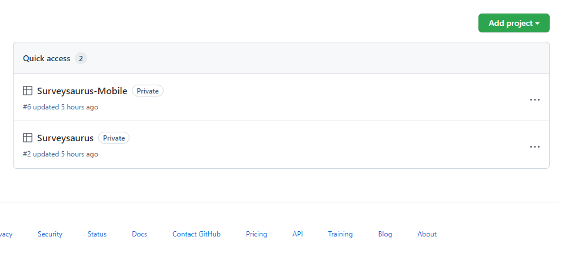
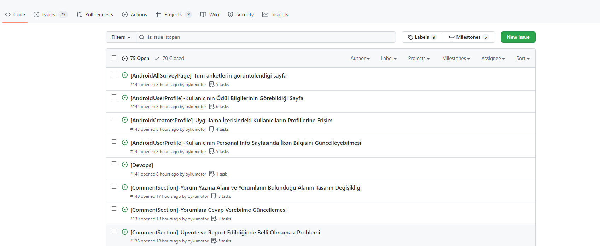
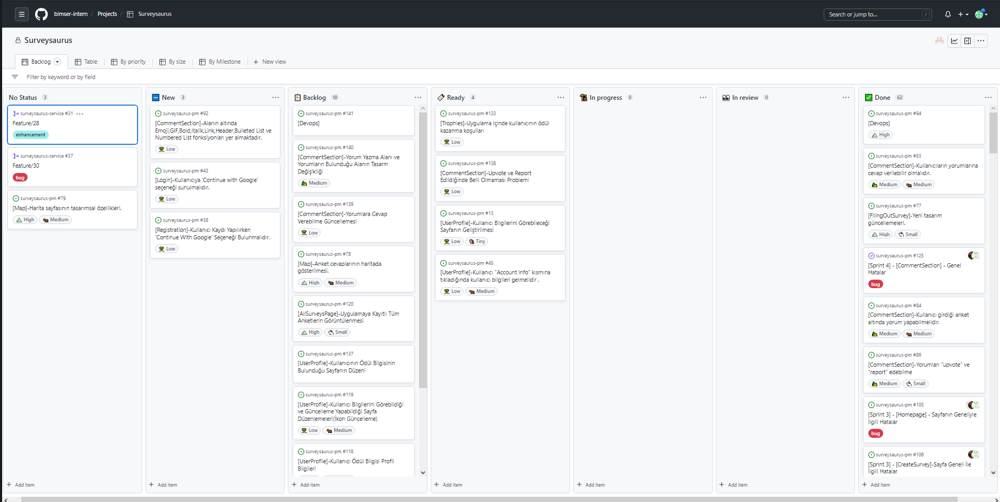
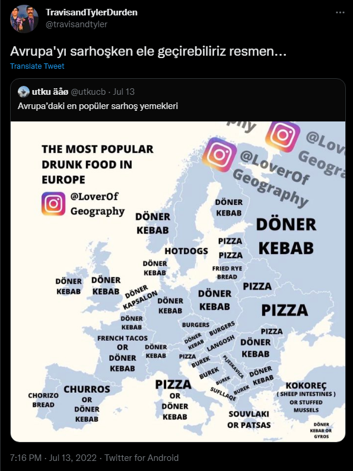
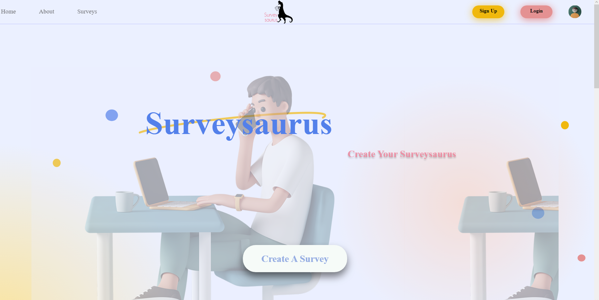
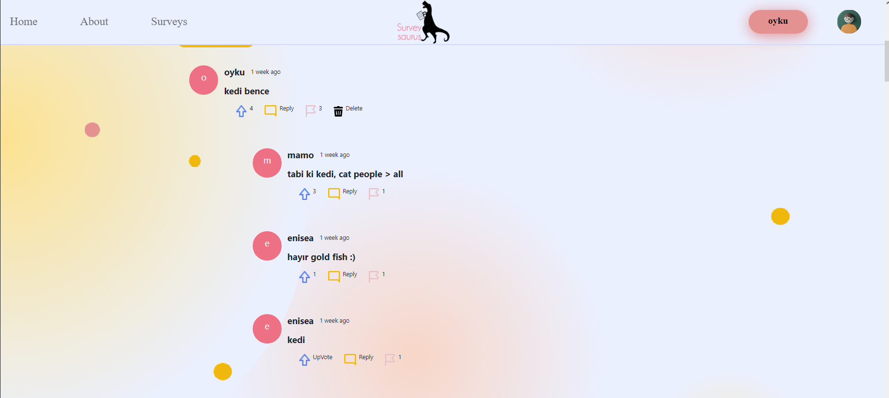

# Surveysaurus-pm

## Surveysaurus-pm ne için kullanılıyor?

Surveysaurus anket uygulamasının işlerinin belirlenmesi, yürütülmesi ve kontrol edilmesi surveysaurus-pm repositorysi üzerinden yapılmaktadır.

"Surveysaurus" ve "Surveysaurus-Mobile" olmak üzere iki proje bulunmaktadır. Ve işler bu projeler üzerinden takip edilmektedir.

"Surveysaurus" projesi uygulamanın web tarafındaki işleri için, "Surveysaurus-Mobile" projesi uygulamanın Android tarafındaki işleri için kullanılmaktadır.

## Surveysaurus Uygulaması İş Takibi Nasıl Yapılmaktadır?

Product owner tarafından hazırlanan işler önce surveysaurus-pm reposunda issue olarak açılmaktadır ve işin detayları belirtilmektedir.

Issuelar web ile ilgili bir iş ise "[Konu]-içerik tanımlaması", android tarafı ile ilgili ise "[androidKonu]- içerik tanımlaması" şeklinde açılmaktadır.

Daha sonra işler, Surveysaurus uygulamasının web tarafındaysa "Surveysaurus" projesine, Android tarafındaysa "Surveysaurus-Mobile" projesine atanmaktadır.

## Proje Yönetiminin Yapılması

- New : Henüz product owner tarafından uygulamaya geçirilmesi onaylanmamış işler new statüsünde olmaktadır.

- Backlog : Product owner tarafından yapılması onaylanmış işler backlog statüsüne alınır. 

- Ready : İşler po tarafından tanıtıldıktan sonra develepor ekibi tarafından kabul edilen işler ready tarafında bekler.

- In Progress : İşlerin, developer ekibi tarafından yapılma sürecinde olduğunu gösterir.

- In Review : Yapılma süreci bitmiş, code review ve diğer kontrollerin yapılması için bekleyen işler içindir.

- Done : In reviewdaki işlerin gerekli kontrolleri yapıldıktan ve po tarafından onaylandıktan sonra done statüsüne çekilir.

## Surveysaurus Uygulaması Fikrinin Çıkış Noktası

Twitterda gördüğümüz bir tweet üzerinde Avrupa'da insanların alkollüyken tüketmeyi en çok sevdiği yemeklerin ülkelere göre haritası paylaşılmıştı. Bu tweetten yola çıkarak anket oluşturma ve yanıtlama uygulaması Surveysaurus tasarlanmaya başlanmıştır.

## Surveysaurus Uygulamasında Neler Yapabilirsiniz ?

Surveysaurus web uygulamasında kendinize hesap oluşturup dilediğiniz tek soruluk anketleri oluşturabilir ve diğer kullanıcıların oluşturduğu anketleri yanıtlayabilirsiniz.

Yanıtladığınız anketlere verilen popüler cevapları görebilir, anket doldurma alanının altında diğer kullanıcılarla etkileşime geçebilirsiniz.

    Uygulamaya bu link üzerinde ulaşabilirsiniz.
- [Surveysaurus](http://40.113.137.113/)

## Surveysaurus Uygulaması Hedefleri

Surveysaurus anket uygulamasının şu anki versiyonunda anketlere verilmiş olan popüler cevapların oranlarını görebiliyorsunuz. Bu özelliğin ileri versiyonlarında verilen popüler cevapların Dünya Haritası üzerinde gösterilmesi olacak. Kullanıcı haritada, hangi ülkede hangi cevap yoğunlukta verildiyse o cevabı görebilecek.

Diğer bir yeni özellik kullanıcılar arasında etkileşimi arttıracak bir özellik olacaktır. Kullanıcılar uygulama içerisinde birbirlerinin profillerini görüntüleyebilecek ve birbirlerinin anketlerini çözebilecek.